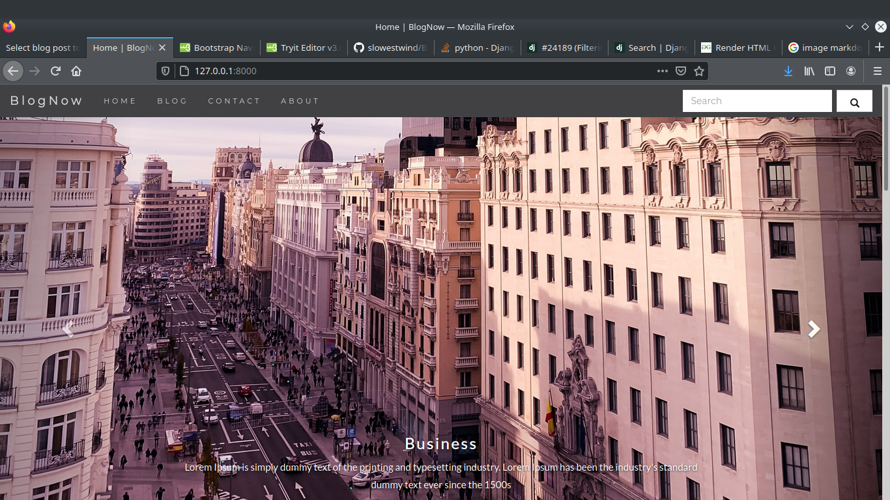

# BlogWithDjango
A fully functional general purpose blog website created with django framework using bootstrap.

## Features
* Nice UI (still on progress)
* Working contact page 
* Post handling from backend
* Search facility
* Pagination 
* Previous and Next Post suggestion

## Preview

### Homepage

### Blogpage

### Pagination: 10 Post per page

### Post page

### suggestion: Previous and Next Post

### Contact page

### About page

## Upcomming Updates
* Better search alogorithm
* user login and signup
* nice interface to write post
* better ui updates
* sidebar update
* comment section
* social media share button

