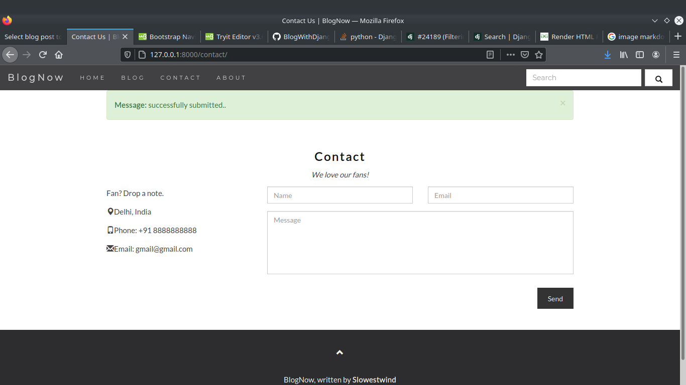

# BlogWithDjango
A fully functional general purpose blog website created with django framework using bootstrap.

## Features
* Nice UI (still on progress)
* Working contact page 
* Blogpost handling from database
* Search in website 

## Preview

### homepage page

### blogpage page

### blogpost page

### contact page

### about page

## Upcomming Updates
* Better search alogorithm
* user login and signup
* nice interface to write post
* better ui updates
* sidebar update
* comment section
* social media share button